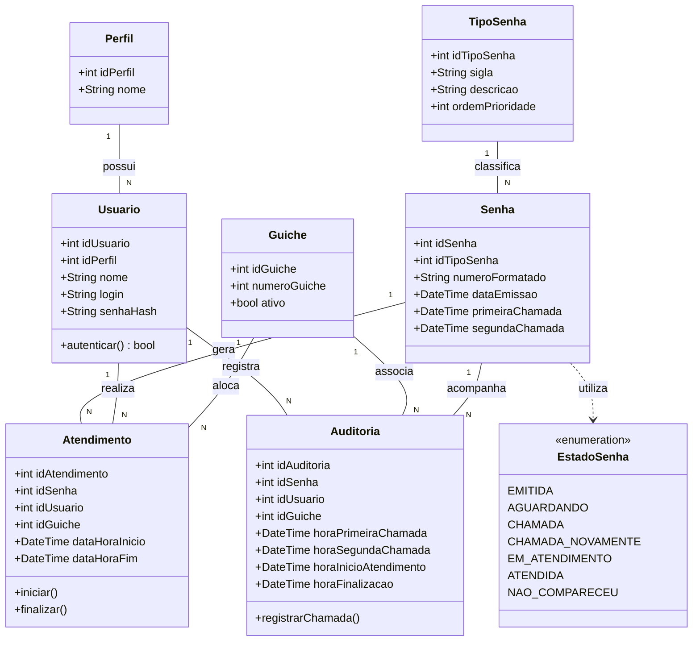

```mermaid
classDiagram
    class Perfil {
        +int idPerfil
        +String nome
    }

    class Usuario {
        +int idUsuario
        +int idPerfil
        +String nome
        +String login
        +String senhaHash
        +autenticar() bool
    }

    class TipoSenha {
        +int idTipoSenha
        +String sigla
        +String descricao
        +int ordemPrioridade
    }

    class Senha {
        +int idSenha
        +int idTipoSenha
        +String numeroFormatado
        +DateTime dataEmissao
        +DateTime primeiraChamada
        +DateTime segundaChamada
    }

    class Guiche {
        +int idGuiche
        +int numeroGuiche
        +bool ativo
    }

    class Atendimento {
        +int idAtendimento
        +int idSenha
        +int idUsuario
        +int idGuiche
        +DateTime dataHoraInicio
        +DateTime dataHoraFim
        +iniciar()
        +finalizar()
    }

    class Auditoria {
        +int idAuditoria
        +int idSenha
        +int idUsuario
        +int idGuiche
        +DateTime horaPrimeiraChamada
        +DateTime horaSegundaChamada
        +DateTime horaInicioAtendimento
        +DateTime horaFinalizacao
        +registrarChamada()
    }

    class EstadoSenha {
        <<enumeration>>
        EMITIDA
        AGUARDANDO
        CHAMADA
        CHAMADA_NOVAMENTE
        EM_ATENDIMENTO
        ATENDIDA
        NAO_COMPARECEU
    }

    Perfil "1" -- "N" Usuario : possui
    TipoSenha "1" -- "N" Senha : classifica
    Senha "1" -- "N" Atendimento : gera
    Usuario "1" -- "N" Atendimento : realiza
    Guiche "1" -- "N" Atendimento : aloca
    Usuario "1" -- "N" Auditoria : registra
    Guiche "1" -- "N" Auditoria : associa
    Senha "1" -- "N" Auditoria : acompanha
    Senha ..> EstadoSenha : utiliza
```